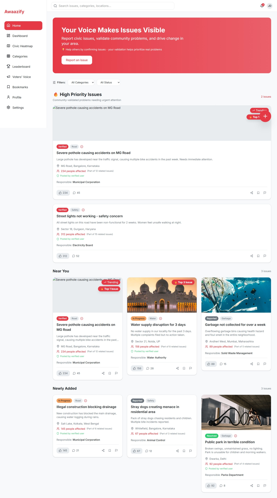
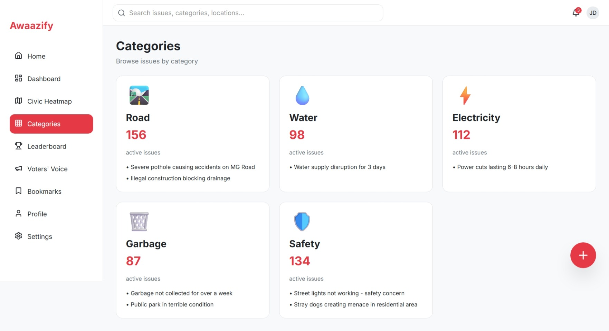
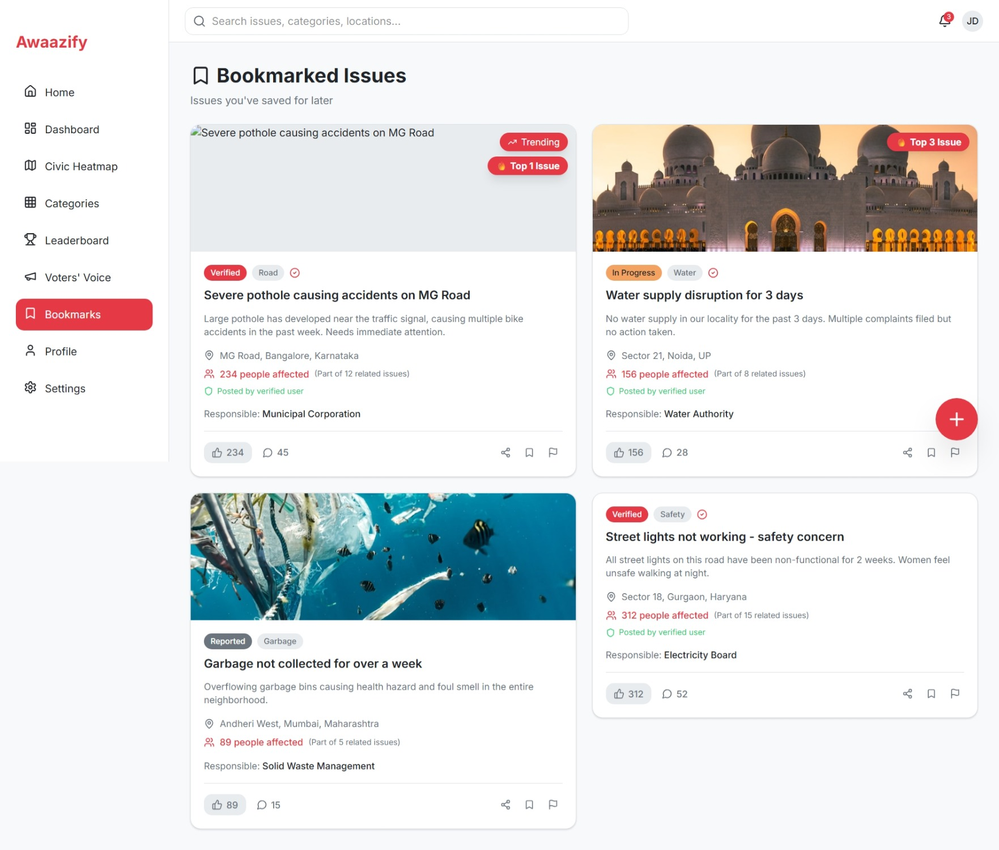
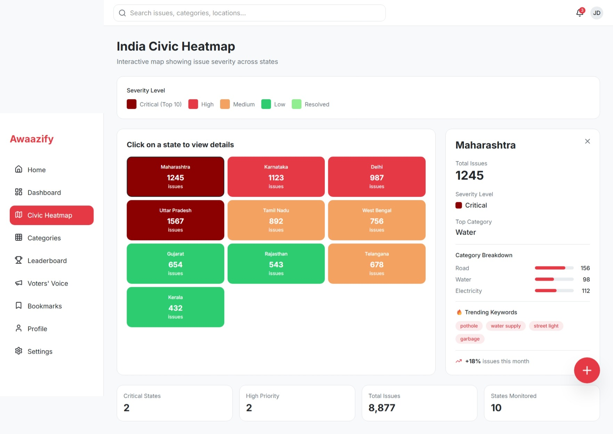
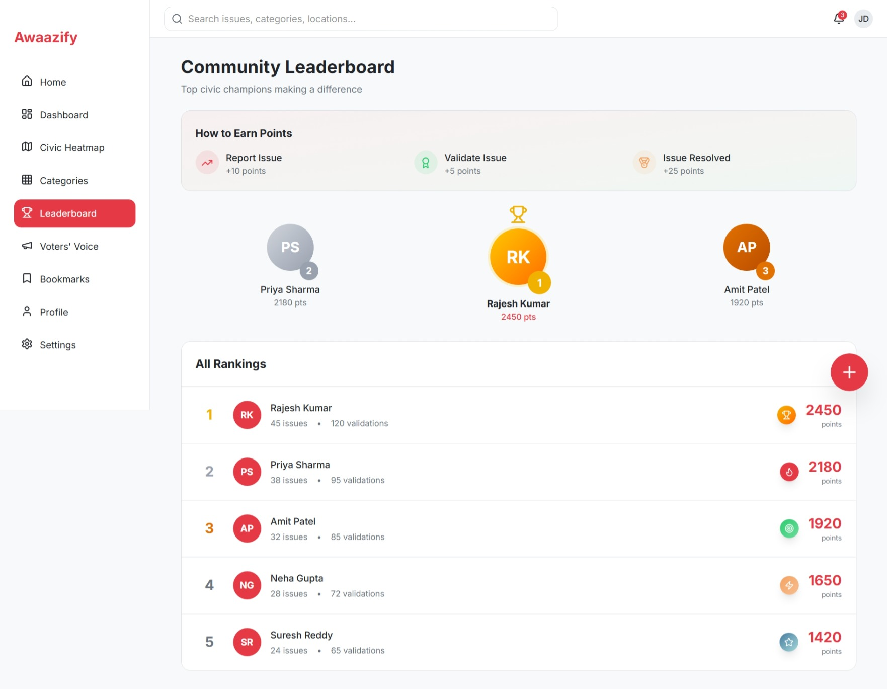
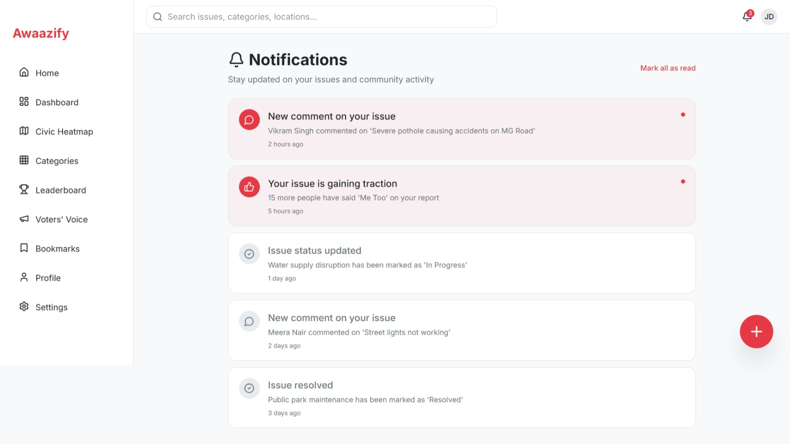
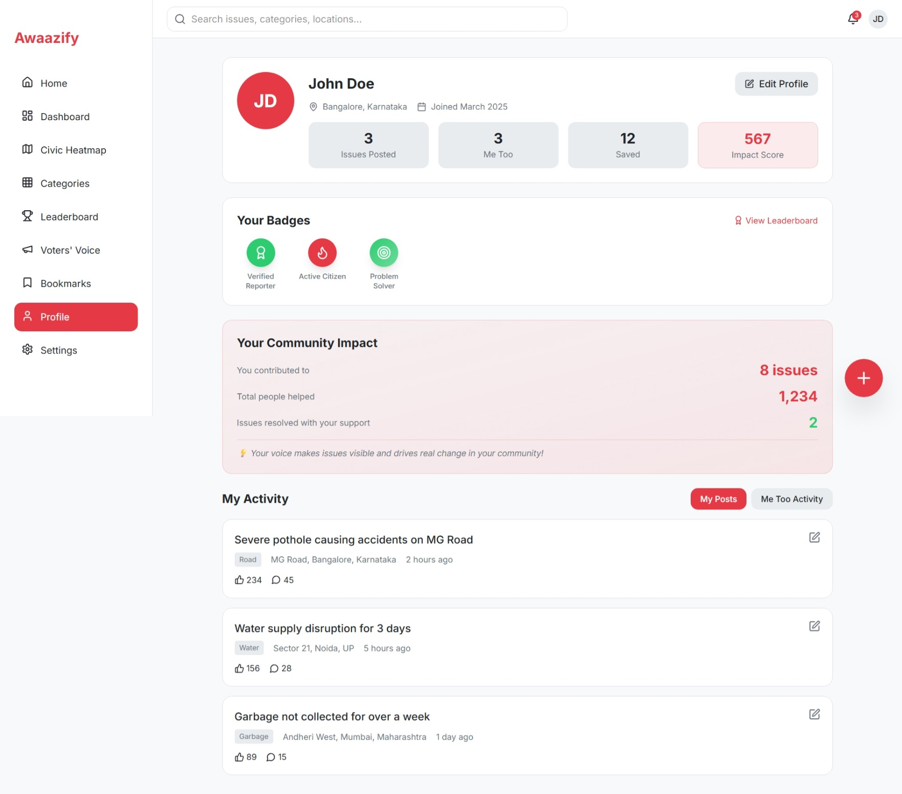
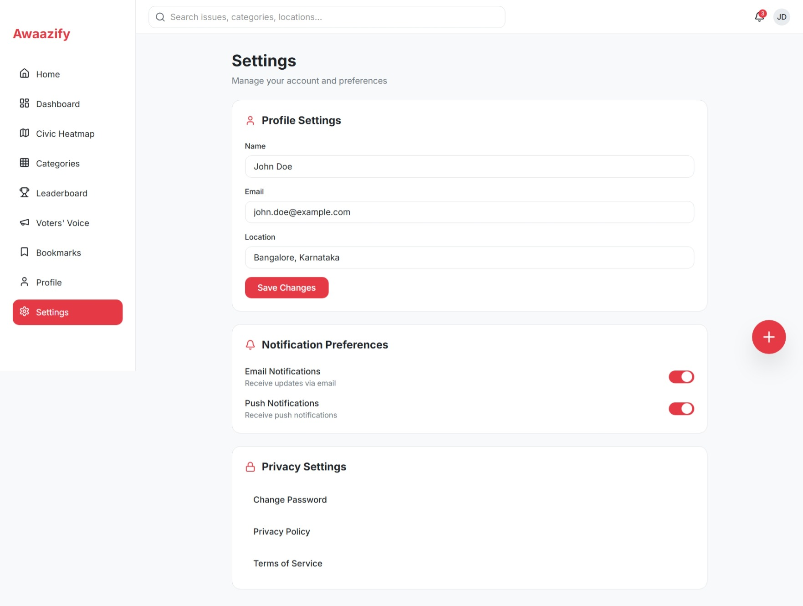

# 🚀 Awaazify – Raise Your Voice

Awaazify is a **community-driven public PR system** that empowers individuals to raise concerns, make issues trend through collective support, and amplify them by tagging government officials on social media for real-world impact.

---

## 🌍 Problem Statement
Many public issues remain unheard due to lack of visibility and ineffective communication channels. Citizens struggle to reach the right authorities, leading to delayed or no resolution.

---

## 💡 Our Solution
Awaazify provides a digital platform where:
- Citizens can raise real-world issues  
- Community engagement helps issues trend  
- Social media amplification ensures visibility  
- Government officials can be tagged for accountability  

---

## ✨ Key Features
- 🗣️ Raise and share public complaints  
- 📈 Community-driven trending system  
- 🔗 Social media tagging for authority reach  
- 🤝 User engagement (support, interaction)  
- 🧠 Smart grouping of similar issues (ML-based)  
- 🏆 Leaderboard for active contributors  

---

## 🧠 Machine Learning Integration
Awaazify uses **unsupervised learning (Clustering)** to enhance impact:

- 🔍 Groups similar complaints using **TF-IDF + K-Means**  
- 📊 Identifies trending issues automatically  
- 🔗 Shows users related complaints  

### 🚀 Future Enhancement
- 📌 Classification for auto-tagging categories (Civic, Transport, Safety)  
- 🤖 Advanced NLP models for better accuracy  

---

## 🏗️ Tech Stack

### 🎨 Frontend
- HTML, CSS, JavaScript / React  

### ⚙️ Backend
- Node.js + Express  

### 🗄️ Database
- MongoDB Atlas  

### 🔐 Authentication
- Firebase Authentication  

### 🤖 Machine Learning
- Python (TF-IDF + Clustering using Scikit-learn)  

---

## 🌐 Deployment Plan
- Frontend → Vercel  
- Backend → Render  
- Database → MongoDB Atlas  

---

## 📊 Survey Form (User Research)
Your feedback is valuable 🙌  

👉 https://docs.google.com/forms/d/e/1FAIpQLSdo9b4t1hVgF4lBDY-egZc48DXcQnbQvL0bI8jZNCVjdzVJWg/viewform?usp=dialog  
Get Certificate

---

## 📸 UI/UX Showcase

### 🏠 Home Page

### 🏡 Dashboard

### 📊 Categories

### 🔖 Bookmarks

### 🔥 Heatmap (Trending Issues)

### 🏆 Leaderboard

### 🔔 Notifications

### 👤 Profile

### ⚙️ Settings

### 🔐 Authentication
  

### 🗳️ Voter’s Voice

---
## TO run
  Run `npm i` to install the dependencies.

  Run `npm run dev` to start the development server.
  

## 🚀 Future Scope
- 🤖 AI-powered issue prioritization  
- 🏛️ Direct integration with government portals  
- 🏆 Reward & incentive system  
- 📱 Mobile application (Android/iOS)  
- 🌍 Location-based issue tracking  

---

## 📌 Project Vision
> “To create a platform where every voice matters and collective action leads to real societal change.”

---

## 👩‍💻 Author
**Khushboo Goyal**  
- B.Tech CSIT Student  
- Data Analyst | Tech Enthusiast | Hackathon Participant  

---

## ⭐ Support
If you like this project:
- ⭐ Star the repository  
- 🔗 Share with others  
- 💬 Give your valuable feedback  

---

## 🚀 Final Note
Awaazify combines **community engagement + machine learning + social amplification** to transform how public issues are raised and resolved.
